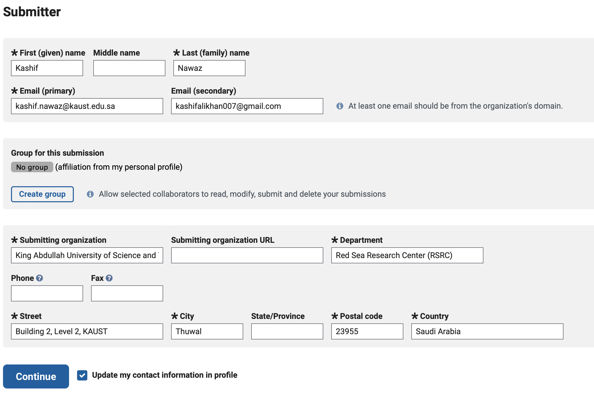
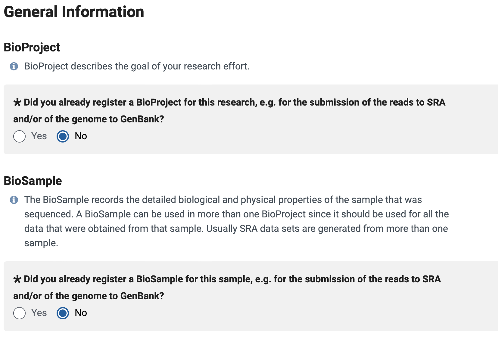
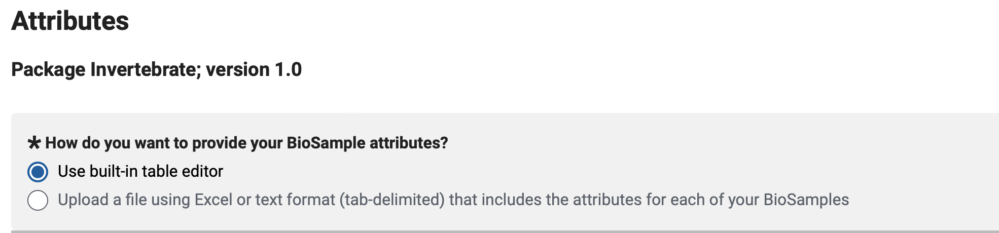
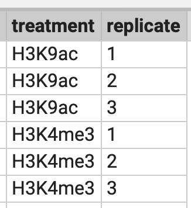
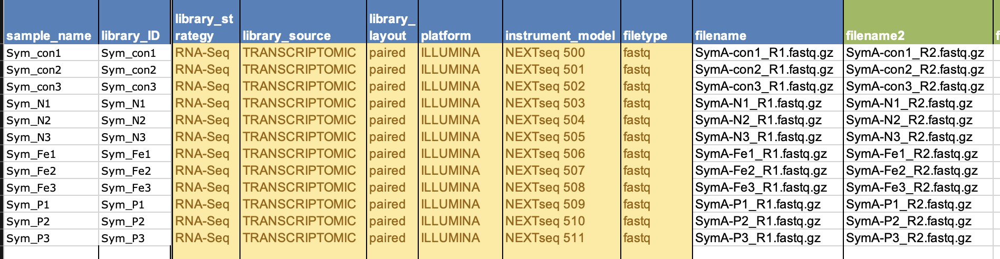

## SRA-data-upload

go to subbmission portal
[SRA subbmission portal] (https://submit.ncbi.nlm.nih.gov/subs/sra/)

go to folder where your files are:

```python
cd file_dir/
```

Use lftp to upload files:

```python
lftp
open -u username,password ftp-private.ncbi.nlm.nih.gov
```

username, password and ftp site will be provided by SRA FTP site.

Go to folder as instructed by SRA FTR site:

```pyhton
cd uploads/kashif.nawaz_kaust.edu.sa_OirvKLRg/new_folder/
```

Upload all fastq.gz files from the folder

```python
mput *fastq.gz
```

Go to New Submission and fill:
1. SUBMITTER 

      
    
2. GENERAL INFO
- Select BioProject and BioSample as "NO" if your submission is new and not related to any existing project.
- Fill release date

    
    
3. PROJECT INFO 

4. BIOSAMPLE TYPE
- Select Plants, bacteria, Select model organism or invertibrate from Aiptasia
5. BIOSAMPLE ATTRIBUTE
- Select built in table. Fill unique sample names, Organism, Isolate, breed etc. If you dont have information of any of the mandatory column fill "not applicable".

    
    
- Most common problem here will be duplicate smple name. To avoid this problem add two columns with name "treatment" and "replicate". Each entry (row) of these two columns should be unique.

        
 
6. SRA METADATA
- Here most of the columns will have option of selection and you will have no problem of duplication. Fill the sample name exact same from last table from BIOSAMPLE ATTRIBUTE. Fill the corresponding file names.

     
    
- Select Submit automatically after fillin this last table.
### DONE!
